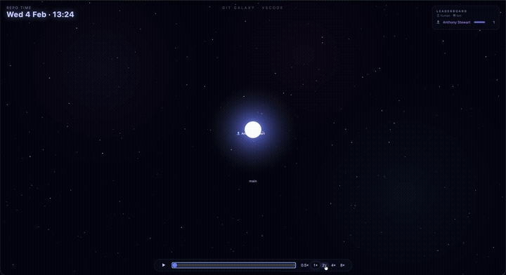

# Git Galaxy 🌌

A flashy, modern [Gource](https://gource.io/) replacement. Turns any git repository's
recent history into an animated **galaxy movie**: the default branch is a glowing core,
feature branches orbit as spiral arms, authors fly around as comets firing commit
particles, and merges explode into the core with shockwaves.

Zero dependencies. One command in, one self-contained HTML file out — double-click it,
no server needed.



## Usage

### npx (no clone needed)

```bash
# run from inside any git repo
npx git-galaxy

# any other repo, any range
npx git-galaxy --repo ~/code/my-project --since="1 month ago"

# any repo on GitHub/GitLab/etc — cloned to a temp dir, cleaned up after
npx git-galaxy --repo https://github.com/ngrx/platform

# the entire history, from the very first commit
npx git-galaxy --forever

# open the result
open dist/git-galaxy.html
```

### From this repo

```bash
# visualize the repo you're currently in (last 2 weeks)
node generate.mjs

# any other repo, any range
node generate.mjs --repo ~/code/my-project --since="1 month ago"

# any repo on GitHub/GitLab/etc — cloned to a temp dir, cleaned up after
node generate.mjs --repo https://github.com/ngrx/platform

# the entire history, from the very first commit
node generate.mjs --forever

# open the result
open dist/git-galaxy.html
```

### Options

| Flag         | Default                 | Description                                    |
| ------------ | ----------------------- | ---------------------------------------------- |
| `--repo`     | current directory       | Path to a local git repository, or a remote URL (`https://`, `ssh://`, `git://`, `git@host:...`) to clone and visualize |
| `--since`    | `"2 weeks ago"`         | Any `git log --since` expression               |
| `--forever`  | _(off)_                 | Visualize the whole history — no start date; cannot be combined with `--since` |
| `--out`      | `dist/git-galaxy.html`  | Output file path                               |
| `--duration` | `90`                    | Movie length in seconds at 1× speed            |
| `--bots`     | _(none)_                | Comma-separated extra bot-name keywords (case-insensitive), e.g. `--bots "renovate,ci scout"` |

## What you see

- **Core** — the default branch (`main`/`master`, auto-detected), pulsing at the center
- **Spiral arms** — branches, each with its own color and label; they grow out on birth
  and collapse into the core with a shockwave + particle burst when merged
- **Comets** — authors, flying to the branch they commit to; particle stream size scales
  with the number of files touched
- **Hexagons ⬡** — bots (dependency-update bots, CI agents, …) are drawn differently from
  humans
- **HUD** — repo-time clock, live author leaderboard, scrolling event ticker
- **Sound effects** — Star Wars-flavored blaster/lightsaber/explosion sounds for commits,
  branch creation, and merges, synthesized live with the Web Audio API (no audio files);
  bigger merges (more commits on the branch) get bigger, more dramatic sounds. Mute with
  the 🔊 button — browsers require a click before audio can play, so sound starts once you
  hit play or mute
- **Playback bar** — play/pause (spacebar), timeline scrubber (seeking deterministically
  rebuilds the world state), speed 0.5×–8×, mute toggle

Quiet periods (gaps > 4 h without activity) are automatically time-compressed so nights
and weekends don't stall the movie.

## How it works

`generate.mjs` runs `git log --all` plus `git for-each-ref`, then:

1. **Parses** commits with file-touch counts (`lib/parse.mjs`)
2. **Merges author identities** across name/email variants and flags bots (`lib/authors.mjs`)
3. **Infers branches** — GitLab/GitHub-style merge-commit subjects
   (`Merge branch 'X' into 'Y'`) name the merged branch; commits are assigned by walking
   first-parent chains from merge points and unmerged branch tips (`lib/branches.mjs`)
4. **Time-warps** the event stream onto the movie timeline (`lib/timewarp.mjs`)
5. **Injects** the JSON payload into `template.html` → `dist/git-galaxy.html`

The template is a single vanilla-JS Canvas 2D app; the page makes no network requests.

## Notes & limits

- Branch inference relies on merge-commit subjects. Squash-merge / fast-forward-only
  repos still work, but branch attribution is limited to unmerged branch tips.
- Repos without an `origin` remote fall back to local branches.
- Author identities merge on identical email **or** identical (case-insensitive) name.
- Bot detection defaults to a generic name pattern (`bot`/`automated agent`/`ci runner`).
  Pass `--bots "name1,name2"` to add your org's actual bot/service-account names.
- Remote URLs are cloned in full (not shallow), since branch inference needs the
  real commit graph; large repos will take longer to clone than to render.

## Development

```bash
node --test lib/*.test.mjs
```

Requires Node 18+.
